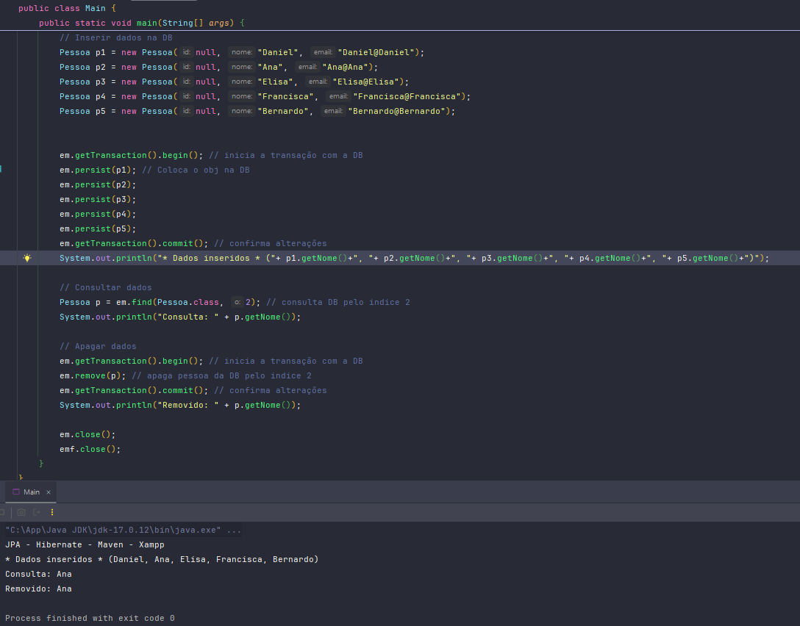
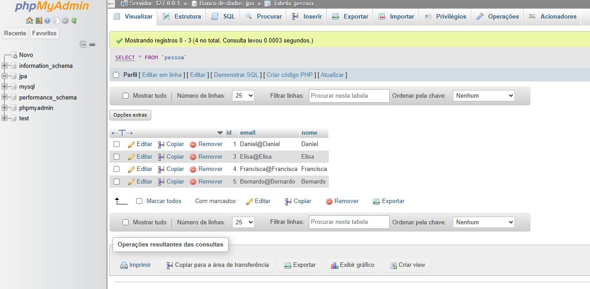
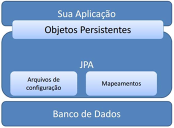

 

 

@author Daniel Gil

# JPA-Hibernate-Maven-Xampp

*** Projeto apenas didático ***

Pequeno sistema que faz uma persistência no baco de dados com o JPA/Hibernate, projeto Maven, e servidor Xampp

Java Persistence API (JPA) é a especificação padrão da plataforma Java EE (pacote javax.persistence) para 
mapeamento objeto-relacional e persistência de dados. 
JPA é apenas uma especificação (JSR 338): 

http://download.oracle.com/otn-pub/jcp/persistence-2_1-fr-eval-spec/JavaPersistence.pdf 

Para trabalhar com JPA é preciso incluir no projeto uma implementação da API (ex: Hibernate). 
Arquitetura de uma aplicação que utiliza JPA:

  

